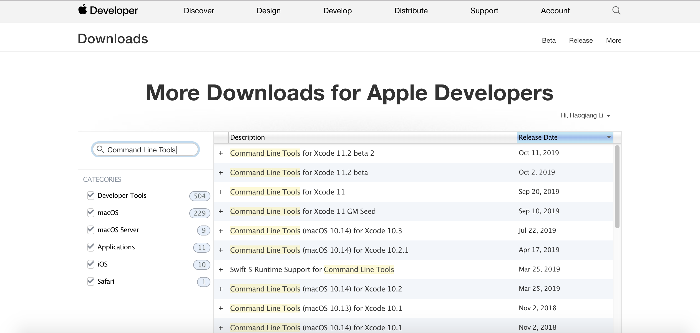
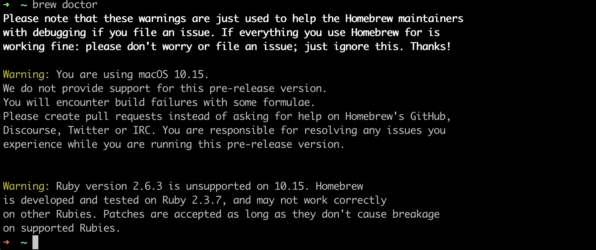
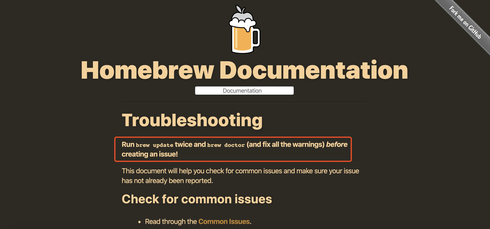

# macOS Mojave(10.14.6)升级Catalina(10.15)
---
##### 2019-10-08苹果向广大用户推送了经过四个多月测试的`Catalina`正式版，新系统激动人心，作为喜欢尝鲜体验的程序员，第一时间当然是升级，但是又担心生产环境收到影响：这个中间件不能用了、那个APP打不开了之类的烦恼。。。管它呢，下载安装了再说，嗯没错，我就是这样搞的，不出意外，出了一些小问题。

1. [桌面多了个文件夹](#1-桌面多了个文件夹)
2. [重新安装CLT](#2-重新安装CLT)
3. [brew检查](#3-brew检查)


## 1. 桌面多了个文件夹

#### 干嘛的不太清楚，反正暂时还没删除，对任何东西没影响，就保留了，希望像Windows一个月之后自动删除。

## 2. 重新安装CLT
Xcode一般不安装（除macOS和iOS应用开发外），但里面的`Command Line Tools`这个工具是非常有用的。从`Mojave`升级到`Catalina`之后之前的`Command Line Tools`会失效，git也不能用了。不管之前有没有安装过，这里建议都安装，自带了git、gcc等工具。
- 之前没安装：
```
xcode-select --install
```
- 之前已安装CLT没安装Xcode升级系统需要重新安装：
```
xcode-select --install
```
- 之前已Xcode升级系统需要重新安装：
1. 由于完整的xcode太占用空间了，最重要的使鄙人并不作mac或ios的开发，所以完全没必要安装这个玩意啊！但是在mac的terminal下没有command line tools还是相当不方便的，这里就介绍一种，只安装command line tools的方法。
2. 下载Command line tools安装包
https://developer.apple.com/download/more/


3. 按照提示安装即可
4. 更改developer tools的路径（这一步主要是针对安装过xcode的用户，卸载xcode后没有清理干净的后果）
```
sudo xcode-select --switch /Library/Developer/CommandLineTools/
```
- 安装完成验证
```
gcc --version
```
```text
➜  ~ gcc --version
Configured with: --prefix=/Library/Developer/CommandLineTools/usr --with-gxx-include-dir=/Library/Developer/CommandLineTools/SDKs/MacOSX.sdk/usr/include/c++/4.2.1
Apple clang version 11.0.0 (clang-1100.0.33.8)
Target: x86_64-apple-darwin19.0.0
Thread model: posix
InstalledDir: /Library/Developer/CommandLineTools/usr/bin
```

## 3. brew检查
- 运行
```
brew doctor
```
- 发现：

- [解决方法](https://docs.brew.sh/Troubleshooting)：

运行两次即可：
```
brew update
```
---
## 总结
新系统升级一般多多少少都会影响原先的配置，遇到问题解决问题就好了，唯一不变的就是变化，尝鲜也是一种态度！